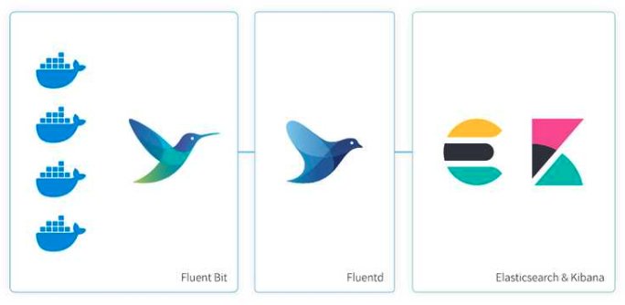

# Fluent bit - Fluentd - Elasticsearch #

### Architecture ###

### Build ###

* docker-compose up -d

### Detail ###

* fluent-bit.conf
  * fluent bit config file
  * Name : 플러그인 이름 (http : http 통신, forward : fluentbit <-> fluentd)

* fluent.conf
  * fluentd config file
  * @type : 플러그인 타입 (file : 파일 처리, elasticsearch : 엘라스틱서치)
  * <match [pattern]>  : restapi 방식으로 uri이 fluentd의 config 에서 pattern 에 해당한다.

* Dockerfile
  * fluentd에서 elastic search 플러그인을 사용하기 위해서 fluent-plugin-elasticsearch 을 설치해야 하므로 도커 이미지를 새로 생성